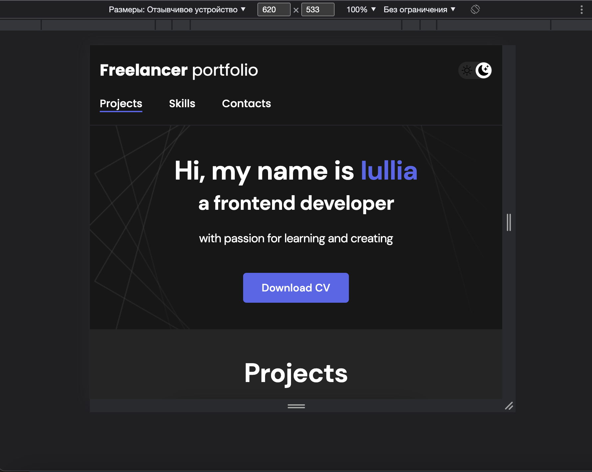
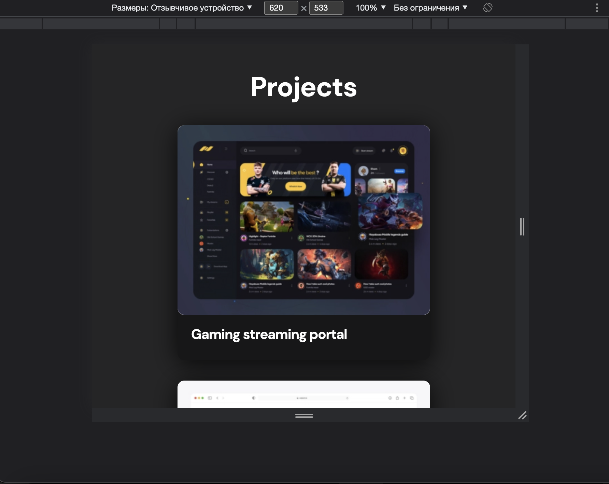
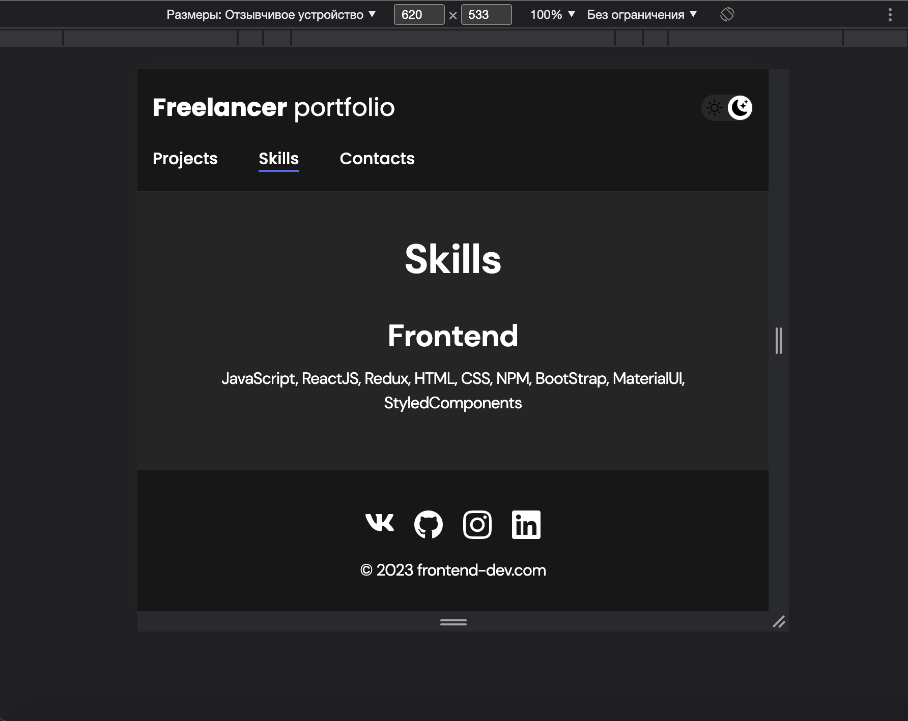

# Адаптивное веб-портфолио

Данный проект представляет собой адаптивное веб-портфолио, выполненное на чистом HTML и CSS. В нем представлены абстрактные примеры работ для демонстрации навыков веб-разработки.

## Технологии

- HTML
- CSS

## Адаптивность

Проект адаптирован для различных размеров экранов и мобильных устройств.

## Скриншоты

## Просмотр

1. Проект можно посмотреть по ссылке: https://iuliiausatova.github.io/Portfolio/skills.html

